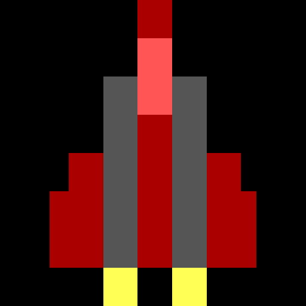

<h1 align="center">
  
  <br />
  Antsy Alient Attack!
</h1>

<p align="center"><b>A game, written in Bash, that is a somewhat retro-a-like shoot 'em up. Hopefully.</b></p>


<p align="center">Made with 💝 for </p>

## Building, Testing, and Installation

### Ubuntu

You'll need the following dependencies:

  * `coreutils` for `stty`
  * [`joy2key`](https://sourceforge.net/projects/joy2key/) *(optional)*
  * `lolcat`
  * `mpg123`
  * `ncurses-bin`
  * `procps`
  * `vorbis-tools`

```bash
sudo apt install coreutils lolcat mpg123 ncurses-bin procps vorbis-tools
```

Execute `./aaa.sh` to run the game.

```bash
./aaa.sh
```

## XBox controller support

This step is optional.

```
sudo apt install libx11-dev x11-utils
wget -c http://sourceforge.net/projects/joy2key/files/joy2key/1.6.3/joy2key-1.6.3.tar.bz2
wget -c http://sourceforge.net/p/joy2key/patches/_discuss/thread/e73f20a1/33d7/attachment/button_list_segfault.patch
tar xvf joy2key-1.6.3.tar.bz2
patch -p0 -i ../button_list_segfault.patch
cd joy2key-1.6.3
./configure --prefix=/usr/local
make
sudo make install
```

## Steam Controller

Player 1 and Player 2 control profiles for [sc-controller](https://github.com/kozec/sc-controller) can be found in the `cfg/` directory.

   * `Antsy Alien Attack - P1.sccprofile`
   * `Antsy Alien Attack - P2.sccprofile`

## Plans

  - [x] Tick
    - [x] Hardware interrupt trap to govern the game loop via a subshell.
  - [x] Input handler
    - [x] Keyboard
    - [x] Xbox360 Controller
  - [x] Graphics
    - [x] Framebuffer
    - [x] Sprite engine
    - [x] Sprite collision detection
    - [X] Sprite overlays
    - [x] Starfield
    - [x] Performance metrics
  - [x] Animators
    - [x] Player thrust
    - [ ] Player roll
    - [x] Explosion animations
  - [x] Audio
    - [x] Sound effects engine
    - [x] Music engine
    - [x] Disable audio for remote connections
  - [x] Title screen engine
    - [x] Main screen artwork
    - [x] Game over artwork
    - [x] Victory artwork
  - [x] Enemies
    - [x] Fighters
    - [x] Hunter Fighter AI
    - [x] Sniper Fighter AI
    - [x] Boss ships
    - [x] Boss ship AI
  - [x] Power ups
    - [x] Bonus points
    - [x] Weapon upgrades
    - [x] Shields
    - [x] Smartbomb
    - [x] Extra life
  - [x] Level progression
    - [x] Number of enemies rises
    - [x] Enemy firepower increases
    - [x] Enemy speed increases
    - [x] Bonus spawn rate decreases
    - [x] Bonus value increases
    - [ ] Canyon levels, narrow playable area
    - [x] Level progression announcements
    - [x] Level-up skill points
  - [x] 2P
    - [x] Local
    - [ ] Network
  - [x] Title screen attract mode
    - [x] High score
    - [x] Configuration
    - [x] Credits
  - [ ] Install
    - [ ] Script
    - [ ] PPA
    - [ ] Snap


## Title Screens

The title graphics are using `toilet` and `lolcat` via [tools/render-titles.sh](tools/render-titles.sh).
You can preview of all the `toilet` font styles using this:

```
for FONT in /usr/share/figlet/*.tlf; do echo $(basename $FONT) && toilet -t -f $(basename $FONT) --filter border "Antsy Alien Attack!" | lolcat -f -F 0.2; done
```

## Game Assets

I found music and sound effects on [Open Game Art](https://opengameart.org).
I ended up using Creative COmmons licensed mmusic from [Patrick de Arteaga](https://patrickdearteaga.com)
and sound effects from [Kenney Vleugels](http://www.kenney.nl) and Viktor Hahn.

## Fonts

### Terminal fonts

  * https://int10h.org/oldschool-pc-fonts/
  * http://www.fixedsysexcelsior.com/
  * https://github.com/ansilove/BlockZone

## ANSI & ASCII

  * https://shiroyasha.svbtle.com/escape-sequences-a-quick-guide-1
  * [Code page 437)](https://en.wikipedia.org/wiki/Code_page_437)
  * [ASCII table , ascii codes](https://theasciicode.com.ar/)

### Editors

  * http://bruxy.regnet.cz/web/linux/EN/ansi-art-sh-paint/
  * http://picoe.ca/products/pablodraw/
  * http://tetradraw.sourceforge.net/
  * https://sourceforge.net/projects/tundradraw/
  * https://sourceforge.net/projects/mysticdraw/
  * http://syncdraw.bbsdev.net/
  * https://www.gridsagegames.com/rexpaint/index.html

## Learnings

  * subshells and traps.
  * `case` is twice as fast as `if`, `elif`, `else`, `fi`.
  * `echo -e` is fast than `tput` and `tput` is faster that `printf`.
  * Arithmetic comparison are faster than tests
    * For example `if ((HUNT_P1 == 1)); then` is faster than `if [ ${HUNT_P1} -eq 1]; then`
  * Bash has C style loops
    * Like this `for (( FIGHTER_LOOP=0; FIGHTER_LOOP < TOTAL_FIGHTERS; FIGHTER_LOOP++ )); do`
  * I never knew about `((TOTAL_STARS++))` or `((TOTAL_STARS+=5))` or `((TOTAL_STARS+=MORE_STARS))`
  * Px437 IBM VGA Regular at 16px is best font.

Slides from a presentation I gave at [FOSS Talk Live](https://fosstalk.com/) 2019 as part of the [Ubuntu Podcast](https://ubuntupodcast.org) live show are also available:

  * [fosstalklive-2019-06.odp](slides/fosstalklive-2019-06.odp)
  * [fosstalklive-2019-06.pdf](slides/fosstalklive-2019-06.pdf)
